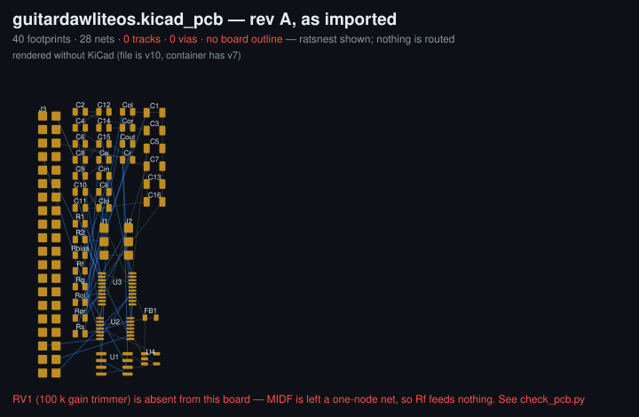

# KiCad GUI review — 2026-07-28

Findings from opening the KiCad project for a visual review of the prototype
wiring. **Three problems, one of them electrical.**

## 1. There is no schematic

`kicad/guitardawliteos.kicad_sch` is **455 bytes**: a title block, an empty
`(lib_symbols)`, and nothing else. No symbols, no wires, no sheets.

```
(title "GuitarDAWLiteOS audio HAT")
(comment 2 "Draw the schematic by following docs/pcb-learning-path.md")
```

It is a deliberate placeholder for the learning exercise, not a drawing. So
there is no GUI schematic to review, and `gen.py` really is the only electrical
representation the project has — which is what
[pinmap-plan-revB.md](pinmap-plan-revB.md) concluded from the other direction.

## 2. RV1 is missing from the board — and it breaks the gain network

`gen.py` emits RV1 (100 k gain trimmer) correctly and it is present in
`guitardawliteos.net`. It is **absent from `guitardawliteos.kicad_pcb`**, so the
board carries 40 footprints against the netlist's 41. Consequences:

| Net | gen.py rev A | On the board |
|---|---|---|
| `FEO` | U1.7, RV1.2, RV1.3, Cout.1 | U1.7, Cout.1 — **RV1 gone** |
| `MIDF` | Rf.2, RV1.1 | Rf.2 only — **one-node net, Rf feeds nothing** |

`MIDF` reduced to a single node means the gain-setting rheostat leg is dangling:
the front-end's feedback network is incomplete on the board. This is not a
cosmetic staleness issue.

The netlist is right, so the loss happened at **import time in KiCad**, not in
`gen.py`. The likely cause is the `Potentiometer_THT:Trimmer_Bourns_3296W_Vertical`
footprint failing to resolve during "Import Netlist", which skips the component
silently.

**Nothing in the repo would have caught this.** `gen.py`'s `erc()` proves the
netlist is self-consistent and `validate.py` checks the `.net` — but neither
looks at the board. Added [`check_pcb.py`](../kicad/check_pcb.py) to close that
gap; it fails on exactly this today.

## 3. The board is an unrouted import, not a layout

0 track segments, 0 vias, no `Edge.Cuts` outline. The 40 footprints sit in the
default import grid, never arranged. What the GUI shows is a ratsnest over a
component pile — useful as a connectivity check, not as a layout.



## Rev A vs rev B on the board

The board is rev A and is **3 components and 6 nets** away from rev B
(`GDAW_REV=B`):

- missing `J4` (Nano MCLK header), `R_mclk` (33 Ω), and `RV1`
- still carries `U4`/`Cli`/`Clo` (the AP2112K LDO that rev B drops)
- `MD0`/`MD1` still on `GND` instead of `+3V3`
- `MCLK` still sourced from `J3.7` (Pi GPIO4), the route ruled out 2026-07-09

## Tooling note

The project files are **KiCad 10** (`generator_version "10.0"`); this container
only had KiCad 7 available, which refuses them outright
(`Unknown token 'generator_version'`). The KiCad PPA and `downloads.kicad.org`
are both blocked from this environment, so the review was done with two
purpose-built stdlib scripts rather than the GUI:

- [`render_pcb.py`](../kicad/render_pcb.py) — parses the board and draws
  footprints, pads and the ratsnest to SVG
- [`check_pcb.py`](../kicad/check_pcb.py) — diffs board against `gen.py` for
  either rev; `--rev A` currently exits 1

Run on a machine with KiCad 10, the GUI will show the same thing.

## Recommended order

1. **Re-import the netlist** in pcbnew and confirm RV1 lands. If it does not,
   fix the footprint library reference in `gen.py` — that is the root cause.
2. Run `python3 kicad/check_pcb.py --rev A` until it exits 0.
3. Only then consider laying out or moving the board to rev B.
