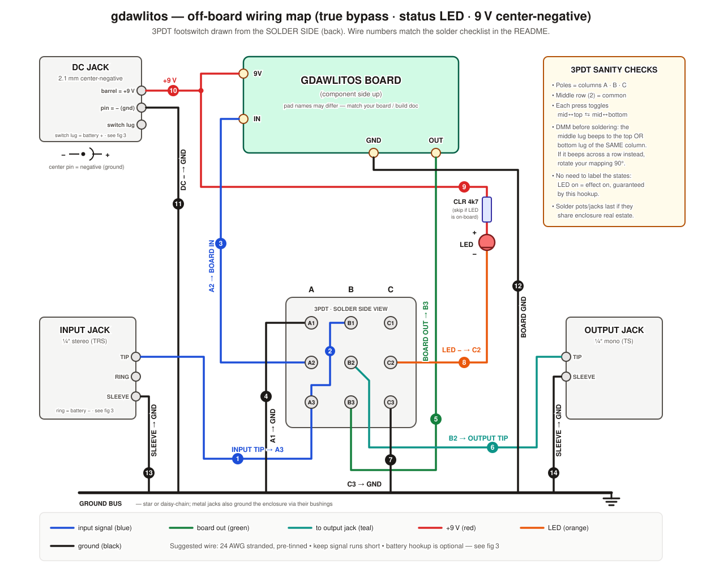

<!-- SPDX-License-Identifier: MIT -->
# Analog pedal wiring map & solder checklist

Labelled off-board wiring for the analog stompbox side of the build: board ↔
3PDT true-bypass footswitch ↔ jacks ↔ DC power ↔ status LED, plus pot/LED
orientation references. Anything **circuit-specific** (pot lug destinations,
extra toggles, on-board LED pads) comes from the effect board's silk / build
doc; hookup points for those are called out where they plug in.

> **Scope — negative-ground, center-negative boards only.** The solder table
> below ties the DC jack's **pin** lug to the ground bus and the **barrel** lug
> to the board's +9 V pad. That is the standard Boss-style negative-ground
> convention and is correct for the overwhelming majority of 9 V pedals — but
> it is **wrong and potentially destructive on a positive-ground board**
> (PNP-germanium fuzzes and treble boosters: Fuzz Face, Rangemaster, Tone
> Bender MkII and their derivatives), where the **+9 V rail is the chassis
> ground**. On those circuits the supply connections invert, the enclosure can
> no longer be a common ground, and sharing a non-isolated daisy-chain supply
> with negative-ground pedals shorts the two rails together. If your board is
> positive-ground, use an isolated supply output and take the power wiring from
> that board's own build doc — figs 1–2 (signal switching) and fig 4 (pot/LED
> orientation) still apply unchanged; wires 9–11 and figs 3/5 do not.

| Figure | Contents |
|---|---|
| [fig 1 — overview](fig1-overview.svg) | Full off-board wiring map; wire numbers match the solder table below |
| [fig 2 — 3PDT states](fig2-3pdt-states.svg) | Switch internals in bypass vs. effect, lug-by-lug map, DMM check |
| [fig 3 — jacks & power](fig3-jacks-power.svg) | Jack/DC lug identification, polarity, optional battery hookup |
| [fig 4 — pots & LED](fig4-pots-led.svg) | Pot lug numbering (front vs. solder side), LED polarity |
| [fig 5 — 18 V power & DSP tap](fig5-power-dsp.svg) | Ryobi 18 V pack → 9 V analog + 5 V Pi rails, star ground, buffered recording tap |
| [fig 6 — pinout reference](fig6-pinout-reference.svg) | Complete Pi 40-pin header (annotated for this rig), TL072 DIP-8, 7809 TO-220 |

> **⚠️ figs 5–6 do not match this repo's as-built architecture.** They were
> drawn for a USB-based rig: Pi powered over USB-C, guitar recorded through a
> **USB audio interface**, Pi header largely unused. GuitarDAWLiteOS is
> bare-metal with **no USB in the audio path** — audio arrives over I²S from a
> PCM1808 (bus master) with an external Nano-ESP32 MCLK, and the 40-pin header
> carries that I²S. For anything on the digital/codec side, the authoritative
> documents are [hardware-review.md](../hardware-review.md) (power tree),
> [schematic.md](../schematic.md), [adc-hookup.md](../adc-hookup.md), and
> [wiring-diagram.svg](../wiring-diagram.svg). Likewise the 9 V op-amp
> front-end in fig 5 is superseded by the SPICE-verified
> [tl072-frontend.md](../tl072-frontend.md). **Figs 1–4 are unaffected** — they
> cover the analog stompbox harness only and stand on their own.

## Wire-by-wire solder map

Numbers 1–14 match the badges in fig 1; battery wires 15–16 are drawn in
fig 3. All lug names (`A1`…`C3`) are as seen from
the **solder side** of the 3PDT: columns A·B·C, rows 1 (top) · 2 (middle =
common) · 3 (bottom).

| # | From | To | Color | Notes |
|---|------|----|-------|-------|
| 1 | Input jack **TIP** | 3PDT **A3** | blue | Guitar signal in |
| 2 | 3PDT **A3** | 3PDT **B1** | blue | Short jumper; bare bus wire is fine |
| 3 | 3PDT **A2** | Board **IN** pad | blue | Signal into the circuit |
| 4 | 3PDT **A1** | Ground bus | black | Grounds board input in bypass (anti-pop) |
| 5 | Board **OUT** pad | 3PDT **B3** | green | Circuit output |
| 6 | 3PDT **B2** | Output jack **TIP** | teal | Signal out |
| 7 | 3PDT **C3** | Ground bus | black | May jumper to A1, then one wire to ground |
| 8 | 3PDT **C2** | LED **cathode** (−, flat side) | orange | LED switching |
| 9 | +9 V → **CLR 4k7** → LED **anode** (+, long leg) | — | red | Skip if the board has on-board LED pads — then use those |
| 10 | DC jack **barrel** lug (+) | Board **9V** pad | red | Center-negative: barrel contact is +9 V |
| 11 | DC jack **pin** lug (−) | Ground bus | black | Center pin is negative! |
| 12 | Board **GND** pad | Ground bus | black | |
| 13 | Input jack **SLEEVE** | Ground bus | black | |
| 14 | Output jack **SLEEVE** | Ground bus | black | |
| 15* | DC jack **switch** lug | Battery snap **red** (+) | red | Optional battery; see fig 3 caveat before wiring |
| 16* | Battery snap **black** (−) | Input jack **RING** | black | Stereo input jack = battery on/off switch |

\* Optional — only if you want battery power. Skip both for adapter-only builds.

**Ground bus** = star or daisy-chain joining: DC pin lug, board GND, A1, C3,
input sleeve, output sleeve. Metal jack bushings ground the enclosure
automatically (scrape paint under one lock washer on powder-coated boxes).

## 18 V battery power & DSP tap (fig 5)

The rig runs from a Ryobi 18 V tool pack via a terminal dock. Two rails: a
**7809 linear regulator** makes the clean 9 V analog rail (no switching noise;
trivial heat at pedal currents), and a **5 V ≥3 A buck converter** feeds the
Raspberry Pi over USB-C (a linear reg would dissipate ~40 W here — buck only).
The 9 V rail ends in a 2.1 mm center-negative plug into the fig 1 DC jack, so
figs 1–4 are unchanged. All grounds meet **once** at a star point.

For chord analysis the Pi records the **dry** guitar signal: a TL072 unity
buffer (on the 9 V rail, ½-supply bias) taps the input jack tip and feeds a
USB audio interface — detection is far more reliable pre-distortion. A spare
pot works as a level trim between buffer and interface (lug 3 ← buffer out,
lug 2 wiper → line-in tip, lug 1 → ground).

| # | From | To | Color | Notes |
|---|------|----|-------|-------|
| 17 | Battery **+** (dock terminal) | Fuse (3–5 A blade) | violet | Fuse within 10 cm of the pack |
| 18 | Fuse | Master switch (SPST ≥3 A) | violet | |
| 19 | Master switch | 7809 **IN** + buck **IN** | violet | One junction, two feeds |
| 20 | 7809 **OUT** | 2.1 mm plug **barrel** (+) | red | Plug goes into the fig 1 DC jack |
| 21 | 2.1 mm plug **pin** (−) | Star ground | black | |
| 22 | Buck **5 V OUT** | Pi **USB-C** | magenta | Ground rides in the USB cable |
| 23 | Input jack **TIP** | Buffer **IN** | blue | Same tip as wire 1 — solder both tails to the lug |
| 24 | Buffer **OUT** | Trim pot → USB interface **line-in** | blue | Pot optional but recommended |

Grounds to the star point: battery −, 7809 GND, buck GND, plug pin (21).
The buffer grounds to the fig 1 ground bus (already reaches the star via 21).

**Power budget / runtime:** Pi 4 under analysis load ≈ 6 W, interface + display
≈ 1 W, analog ≈ 0.5 W → ≈ 9 W from the pack. A 2 Ah pack (36 Wh) gives roughly
**3.5–4 h**; 4 Ah roughly double. Stop at 15.0 V — fit a low-voltage-cutoff
module to protect the pack.

Pin-level detail for the Pi header, the TL072 buffer, and the 7809 lives in
**fig 6** — in this rig the Pi's header is optional (I²C chord display and
footswitch sensing only); power arrives by USB-C and audio by USB.

**Parts:** Ryobi terminal dock/adapter · blade fuse holder + 3 A fuse · SPST
toggle ≥3 A · 7809 (TO-220) + 100 nF/10 µF caps + clip-on heatsink · 5 V ≥3 A
buck rated ≥24 V input · TL072 + bias resistors + coupling caps (or a premade
buffer) · USB audio interface with instrument/line input · spare pot
(10k–100k) as level trim · low-voltage-cutoff module (~15 V).

## Build order checklist

**Bench (switch not yet mounted):**

- [ ] DMM the 3PDT: confirm each **middle** lug beeps to the top *or* bottom lug
      of the **same column**, toggling per press. If it beeps across a row,
      rotate your mapping 90° (fig 2).
- [ ] DMM the DC jack: identify pin / barrel / switch lugs (fig 3).
- [ ] Cut wires with ~2 cm slack after a test-fit in the enclosure; pre-tin
      everything.
- [ ] Solder jumper **2** on the switch, and tails for **1, 3, 4, 5, 6, 7, 8**
      (leave free ends).

**In the enclosure (hardware mounted):**

- [ ] Power first: **10**, **11** — then meter it: barrel↔9V pad beeps,
      barrel↔ground does **not**.
- [ ] Grounds: **12, 13, 14**, then terminate **4** and **7**.
- [ ] Signal: terminate **1** at the input tip, **3** at board IN, **5** at
      board OUT, **6** at the output tip.
- [ ] LED: **8**, **9** (mind polarity — fig 4). If LED is board-mounted, skip.
- [ ] Battery (optional): **15**, **16** after reading the fig 3 caveat.
- [ ] Pots: per the gdawlitos board doc. Remember the lug order **flips** when
      viewed from the solder side (fig 4).

**Pre-flight (before first power):**

- [ ] DC pin lug ↔ input sleeve: **beep** (ground net complete)
- [ ] DC barrel lug ↔ board 9V pad: **beep**; barrel ↔ ground: **no beep**
- [ ] Input tip ↔ output tip: beeps in one switch state (bypass), not the other
- [ ] LED orientation double-checked (flat side → C2)

**First power-up:** use a current-limited supply or check idle draw in series
with a DMM if you have one. LED should toggle with the switch; bypass should
pass guitar cleanly; then verify the effect path.

## Troubleshooting quick hits

| Symptom | Look at |
|---|---|
| LED never lights / always on | Pole C wiring (7, 8, 9) or switch mapping rotated — redo the fig 2 DMM check |
| Bypass works, effect silent | 3 and 5 swapped (board IN/OUT), or board-side issue |
| Effect works, bypass silent | Jumper 2 missing/cold, or B1/B2 solder joints |
| Loud pop on switching | Board pulldown resistors (board-side), or LED CLR too small |
| Works on adapter, dead on battery | DC jack switch-lug pairing — fig 3 caveat |
| Hum on adapter only | Non-isolated daisy chain; try an isolated supply |
| Everything dead, adapter warm | **Polarity!** Power off, re-check 10/11 against fig 3 |

## Conventions

- Wire: 24 AWG stranded, pre-tinned; keep signal runs short.
- Colors as drawn: blue = input signal, green = board out, teal = to output
  jack, red = +9 V, orange = LED, black = ground.
- 3PDT drawn from the solder side everywhere in these figures.
- Pot lugs numbered 1-2-3 **viewed from the front** (shaft toward you, lugs
  down); lug 2 is always the wiper.

Moved here from `pedal-workshop` (was `docs/wiring/gdawlitos/`).
